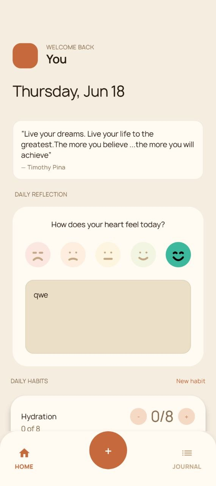
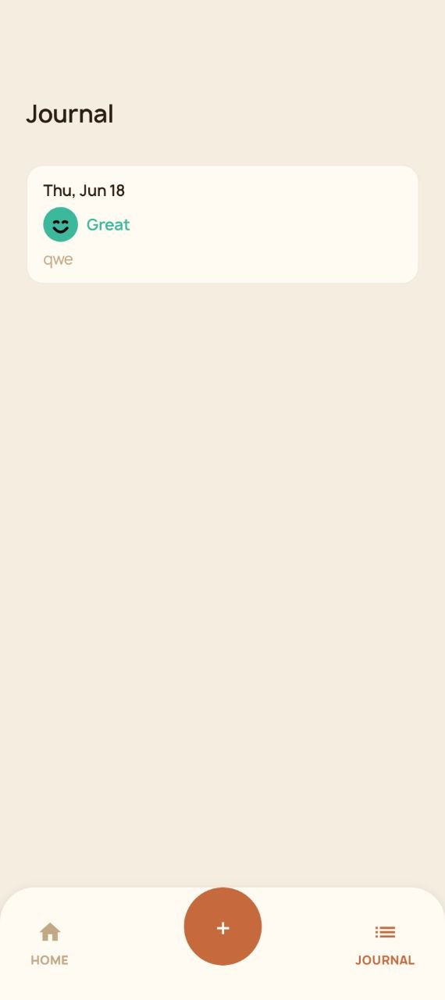

# HabitsTracker

> **Work in progress**

A minimalist habit tracking app with daily mood reflection and a quote of the day. Built with Kotlin Multiplatform targeting Android, iOS, and Desktop JVM from a single codebase.

## Screenshots

| Home | Journal |
|------|---------|
|  |  |

## Stack

| Layer | Technology |
|-------|-----------|
| Language | Kotlin 2.3 |
| UI | Compose Multiplatform 1.10 |
| Targets | Android · iOS · Desktop JVM |
| Database | Room 2.8 KMP + BundledSQLiteDriver |
| Networking | Ktor 3.1 |
| DI | Koin 4.x |
| Navigation | AndroidX Navigation3 (type-safe, `@Serializable` routes) |
| Async | Kotlin Coroutines + Flow |
| Date/Time | kotlinx-datetime |
| Serialization | kotlinx-serialization |

## Architecture

The project follows a **feature-based modular MVI** architecture with clean layer separation.

### Module structure

```
composeApp/          — app entry point, Koin setup, navigation host, bottom bar
core/                — shared design system, models, navigation contracts, utilities
core/database/       — Room database, entities, DAOs (separate Gradle module :database)
feature/
  home-api/          — public contract (routes, callbacks)
  home-impl/         — home feature implementation
  journal-api/       — public contract
  journal-impl/      — journal feature implementation
```

Each feature is split into `-api` (public interface consumed by `composeApp`) and `-impl` (internal implementation).

### Layer structure within a feature

```
Data        XxxRepository  ──►  domain model
Domain      XxxUseCase     ──►  domain model
Presenter   XxxViewModel   ──►  XxxState / XxxIntent / XxxEffect
UI          XxxScreen + components/
```

- **Data** talks only to domain models — never to UI state
- **Domain** use cases are single-responsibility and inject `DateProvider` / repositories
- **Presenter** holds a `StateFlow<State>` and a `SharedFlow<Effect>`; navigation is called directly from the ViewModel via injected `Navigator`
- **UI** is stateless — receives state and dispatches intents

### MVI contracts

Each feature defines a `XxxContract.kt` alongside the ViewModel:

```kotlin
sealed interface XxxIntent   // user actions
data class XxxState(...)     // UI state snapshot
sealed interface XxxEffect   // one-shot side effects (navigation, toasts)
```

### Dependency injection

Koin 4.x. Each feature registers its own `module { }`. Platform-specific bindings (engine, context, API keys) are passed in via `platformModule` from the entry point (`MainActivity`, `main.kt`, `MainViewController`).

### Navigation

Type-safe via `Navigation3`. Each feature's `-api` module defines a `@Serializable` sealed interface implementing `NavKey` (e.g. `HomeScreenRoute`, `JournalScreenRoute`). `Navigator` (in `core/navigation/`) wraps a `SnapshotStateList<NavKey>` back stack. The `FeatureEntryBuilder` pattern lets each feature register its own nav entries without `composeApp` importing impl details.

## Features

- **Home** — greeting, date, quote of the day (fetched from API Ninjas, cached in Room by date), daily mood reflection with emoji picker, habit tracking (binary and count-based)
- **Journal** — chronological list of past reflections showing date, mood, and note
- **Habit management** — create, edit, and delete habits